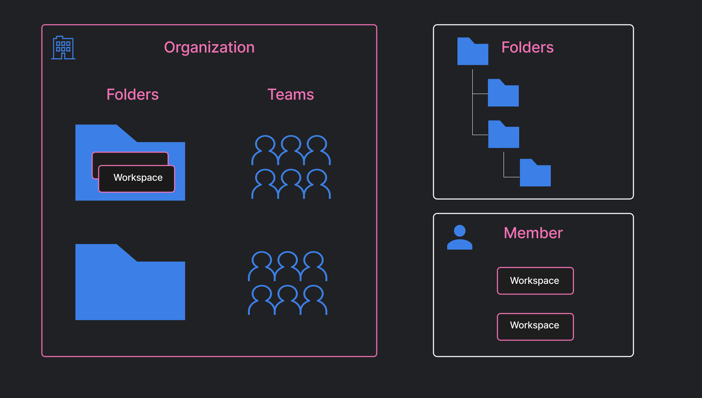
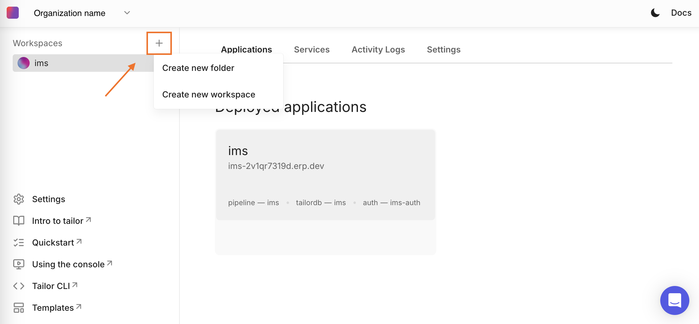
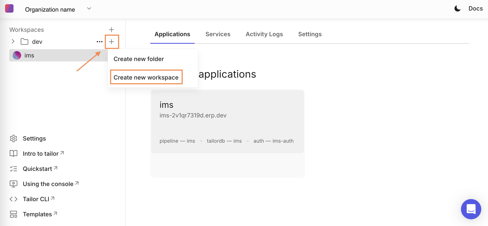
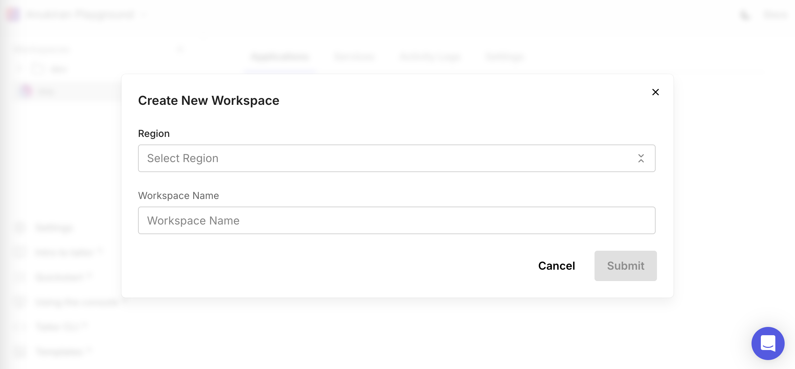
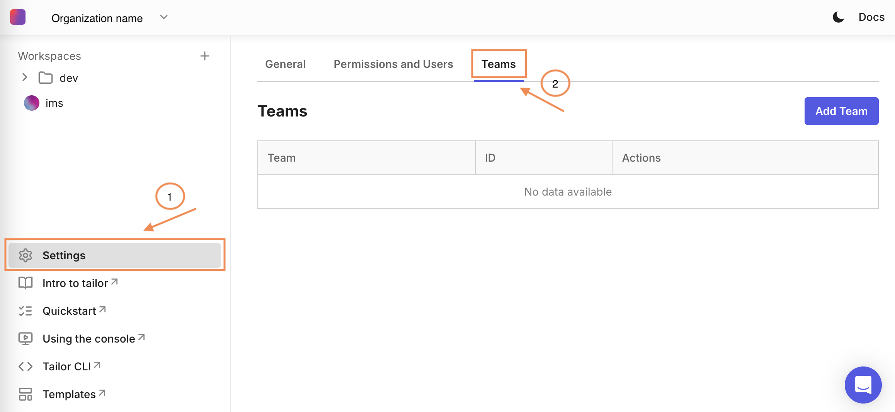

# Platform Account management

The Tailor Platform enables comprehensive account management for admins and developers through the [Console](https://console.tailor.tech).
This functionality is key to managing user permissions, roles, organization accounts, folders, and teams, facilitating effective collaboration and resource organization.

The Platform implements a hierarchical structure to organize accounts and manage access:

Structure Overview

- Organizations
  - Folders
    - Workspace

- Teams
  - Members

Each level (Organization, Folder, Team) supports role-based access control to help manage permissions efficiently at every layer.

&#x20;To get started, please [contact us](https://www.tailor.tech/demo) to create an Organization.&#x20;

## Organization

Organization admins and editors manage teams and folders, while viewers can develop apps within assigned workspaces.

Roles and permissions define access and responsibilities.

Here's a list of permissions for each role

| Permission                          | Admin | Editor | Viewer |
| ----------------------------------- | ----- | ------ | ------ |
| Manage organization access controls | ✅    | 🚫     | 🚫     |
| Create folders                      | ✅    | ✅     | 🚫     |
| Modify folders                      | ✅    | ✅     | 🚫     |
| Create teams                        | ✅    | ✅     | 🚫     |
| Manage team members                 | ✅    | ✅     | 🚫     |

## Folders

You can organize workspaces using folders and control team access.
As a Folder admin, you can invite team members individually or an entire team with specific roles, ensuring members only interact with relevant resources.

Here's a list of permissions for each role

| Permission                    | Admin | Editor | Viewer |
| ----------------------------- | ----- | ------ | ------ |
| Modify the folder name        | ✅    | 🚫     | 🚫     |
| Manage folder access controls | ✅    | 🚫     | 🚫     |
| Manage folders                | ✅    | 🚫     | 🚫     |
| Manage sub folders            | ✅    | ✅     | 🚫     |
| Manage workspace              | ✅    | ✅     | 🚫     |

&#x20;Sub folder creators are granted admin rights only for the subfolder they create&#x20;

To create a new folder from the [Console](https://console.tailor.tech), select the organization, click on the '+' sign, select 'Create new folder', enter the folder name, and click 'Submit'.

To create a new workspace, select the organization, click on the '+' sign and select 'Create new workspace'.

Select the region from the dropdown menu, enter the workspace name, and click 'Submit'.

## Teams

You can manage teams by inviting organization members and assigning roles to the team members.

Here's a list of permissions for each role

| Permission           | Admin | Manager | Member |
| -------------------- | ----- | ------- | ------ |
| Modify the team name | ✅    | 🚫      | 🚫     |
| Manage team members  | ✅    | ✅      | 🚫     |

To create a team in your organization, first select `Settings`, then select the `Teams` tab.

