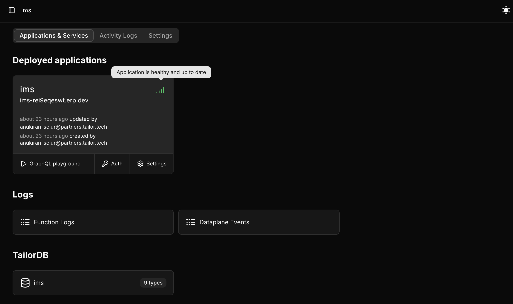
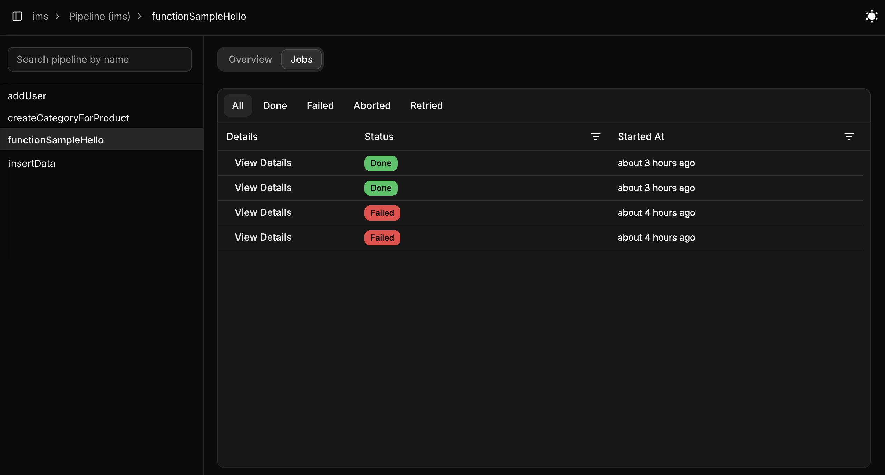
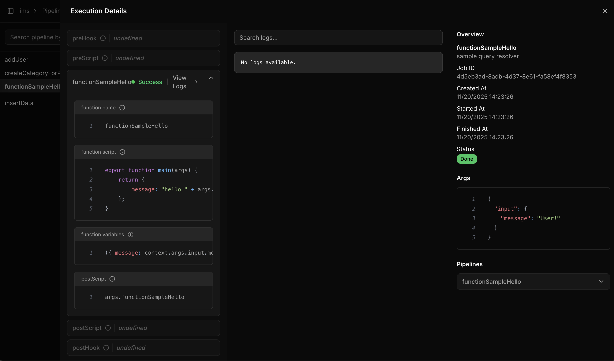
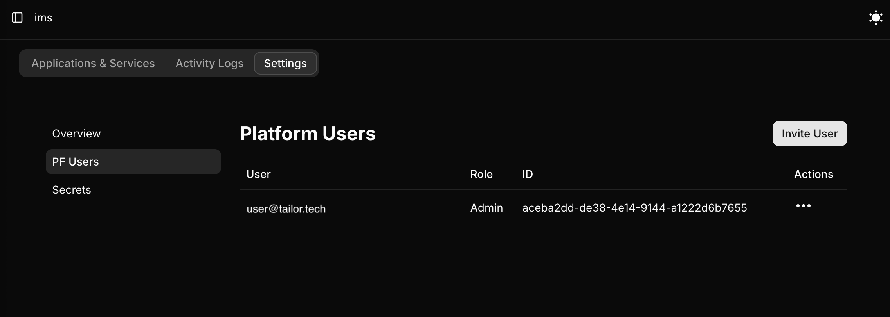
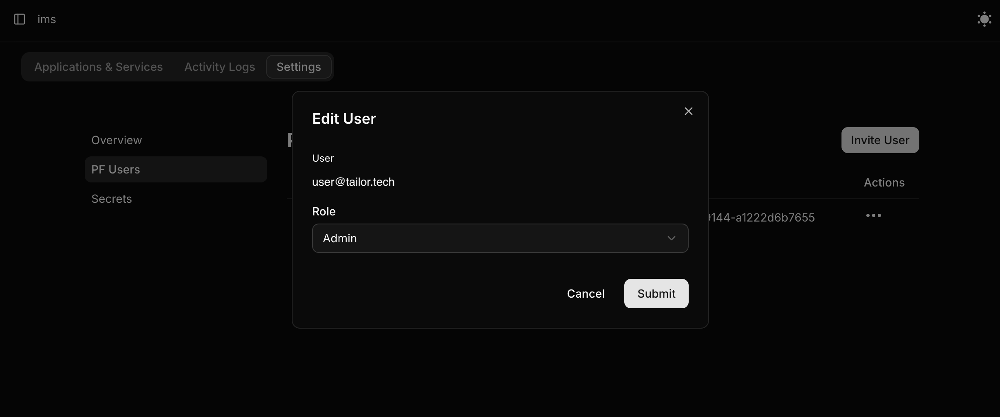

# Console Features

## Application Status

The Application Card displays clear status indicators to help you quickly assess the state of each application.

### Status Types

🟢 Healthy and Up-to-Date: Indicates that the application is running normally and using the latest schema.

🔴 Unhealthy Schema: The application is in an unhealthy state, and its serving schema is outdated.

🟠 Unknown Status: The current status of the application cannot be determined.

🚫 Disabled: The application is currently disabled.

Each status includes a tooltip providing a brief explanation for additional clarity.

## Pipeline Execution Logs

Pipeline resolver execution logs include timestamps, messages, and status information to help you debug and monitor your pipelines.

To view the logs, select the `Pipeline` option for your application in the console and choose the pipeline resolver to inspect.

Click on `View Details` to learn more about the pipeline resolver execution.

For more detailed information about `Pipeline`, refer to [Pipeline resolvers](/guides/resolver).

## Platform user roles

As a workspace admin, you can change platform users role for the workspace. Once you update and save these changes, you cannot revert the user role unless you remove the user and add them back with the desired role.

Follow the steps below to change the PF users role in the [Console](https://console.tailor.tech).

1. Select the workspace `Settings` tab and navigate to `PF users` in the sidebar.

2. Choose the desired role for the user and click `Submit` to update the user role.

Refer [Permissions of the Platform user](/administration/workspace#permissionsoftheplatformuser) for more information about the roles and permissions.
