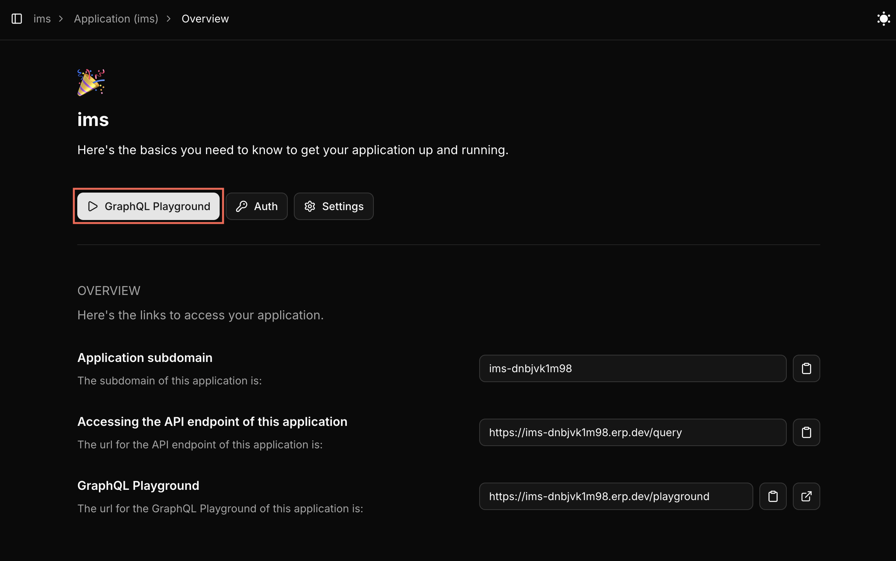
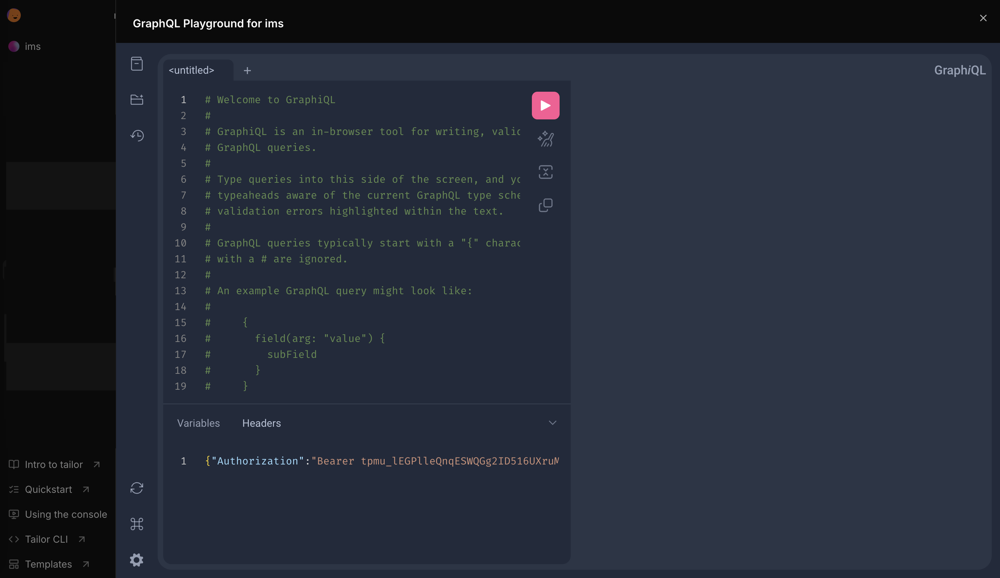
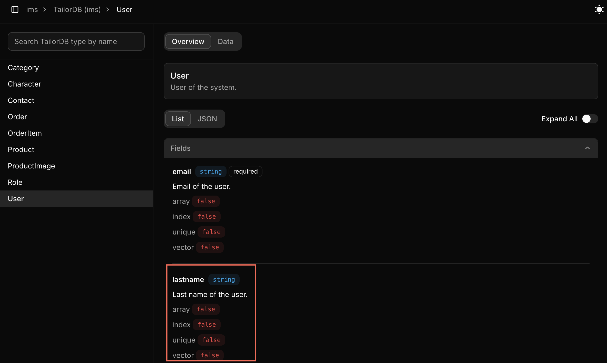

# Console

The [Console](https://console.tailor.tech) is a web-based interface that gives you a unified view of everything running inside the Tailor Platform.
It’s designed to simplify observability and operational workflows by letting you quickly inspect resources, interact with data, and manage workspaces.

With the console, you can monitor platform resources in real time, explore and work with data, manage workspaces and their assets, and perform key operational actions such as importing data or managing secrets.

## Core Capabilities

The Console provides the following key features:

- **Application Overview**: View and manage your deployed applications with a comprehensive dashboard
- **GraphQL Playground**: Test and execute GraphQL queries and mutations with an embedded playground
- **Schema Management**: Browse data models and database schemas
- **Pipeline Management**: Monitor and debug pipeline executions with detailed logs
- **User Role Management**: Configure platform user roles and permissions for workspace access
- **Organization Management**: Manage organization settings and configurations
- **Organization User Role Management**: Configure and manage user roles and permissions at the organization level
- **Data Operations**: Import and view table data with pagination
- **Manage Secrets**: Create and update secrets in the workspace settings
- **Workspace Management**: Configure and manage workspace-level settings and integrations

## Explore Your New App

After deploying your application, the console gives you several ways to explore, manage, and work with your app’s data and resources.

### Test with GraphQL Playground

In the application, select the `GraphQL Playground` from the left navigation panel.



This opens an embedded `GraphQL Playground` with a pre-populated access token, allowing you to execute queries and mutations for the following data operations.



#### 1. Fetch and filter data

Retrieve and refine data using queries to filter and sort the data based on defined criteria.
You can refer to examples for filter and sort operations [here](/getting-started/graphql#filterandsortexample).

#### 2. Create, update, and delete records

Manage your data dynamically by executing mutations to create new entries, modify existing records, or remove them as needed.
You can refer to examples for mutations [here](/getting-started/graphql#mutations).

The application comes pre-loaded with sample data to help you get started. When you're ready to work with your own data, you can import CSV files by following the [Import CSV Files](/tutorials/manage-data-schema/import-csv-file) tutorial.

#### 3. Validate input data

You can confirm that the input data aligns with the validation rules defined in the schema. To learn more about data validations, refer to the guide [here](/guides/tailordb/validations).

### Customize your application

#### 1. Set Up Your Workspace

Configure your workspace to match your deployed application. You can view and manage workspaces using the `tailor-sdk` CLI.

```bash
tailor-sdk workspace
```

#### 2. Update the configuration file

For example, to modify the `User` type with a new field, update your TailorDB type definition:

```typescript
import { db } from "@tailor-platform/sdk";

export const user = db.type("User", "User of the system", {
  name: db.string(),
  email: db.string().unique(),
  // Add new field
  lastname: db.string().description("Last name of the user"),
});
```

#### 3. Apply your changes

After updating the configuration, deploy your changes:

```bash
npm run deploy
```

#### 4. Verify your changes

In the console, you can see the new field added to the `user` schema on the overview page.



#### Troubleshooting

If you encounter issues:

1. Verify your workspace selection
2. Check your configuration file
