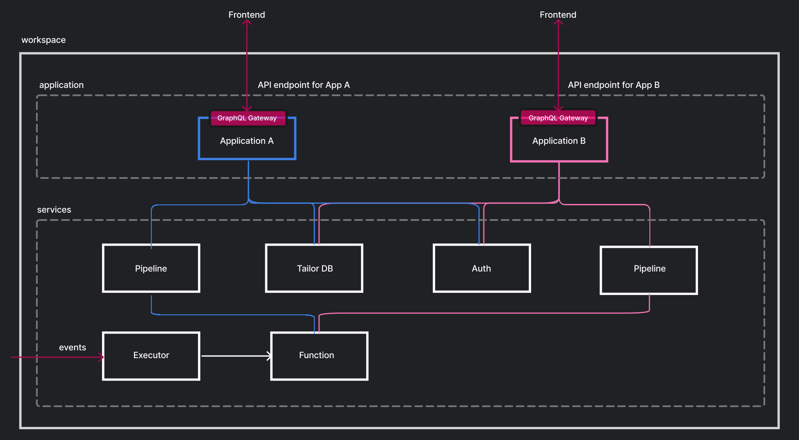

# Platform Architecture

Tailor Platform resources are organized in a hierarchical structure.
The following diagram illustrates the relationship between resources:



## Resource Hierarchy

### Workspace

A [Workspace](/administration/workspace) is the top-level namespace in the Tailor Platform for your organization.

- An application must belong to a Workspace
- Multiple applications can be hosted within a Workspace
- A workspace can have multiple admin users who manage the workspace and its applications

With the SDK, you can create a workspace using the CLI:

```bash
npx tailor-sdk workspace create --name my-workspace --region us-west
```

### Application

An **Application** represents your ERP application APIs, such as CRM, SCM, or any customized applications.

Each application can:

- Register services (TailorDB, Pipeline, Auth) for use
- Configure CORS settings
- Provide a single GraphQL endpoint for all configured services

With the SDK, applications are defined in `tailor.config.ts`:

```typescript
import { defineConfig } from "@tailor-platform/sdk";

export default defineConfig({
  application: {
    name: "my-app",
    subgraphs: ["tailordb", "pipeline", "auth"],
  },
  // ... other configuration
});
```

### Services

A **Service** is a pluggable microservice that you use to build applications.
The application handles stitching services together to provide a single GraphQL endpoint.

Learn more about available services in [Platform Services](/getting-started/core-concepts/services).

## Next Steps

- [Workspace & Application](/getting-started/core-concepts/workspace-application) - Learn more about workspaces and applications
- [Services](/getting-started/core-concepts/services) - Explore available platform services
- [Quickstart](/getting-started/quickstart) - Build your first application
