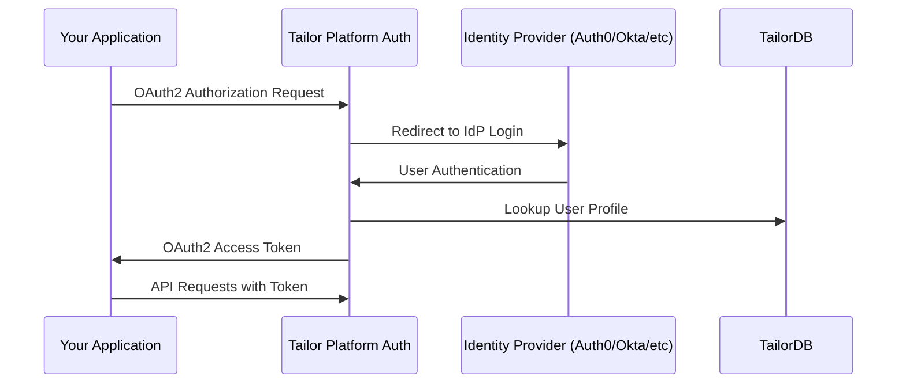

# Log in to your app

Applications on the Tailor Platform use both authentication and authorization:

- Authentication: Handled by an external Identity Provider (Okta, Entra ID, Google Workspace) to verify user credentials.

- Authorization: Enforced by the Tailor Auth service, which maps the authenticated identity to a valid TailorDB user and applies permissions.

After integrating your Identity Provider (IdP) with the Auth service, a user must exist in both the IdP and the Tailor Platform to successfully log in. This guide explains the concepts for:

1. **User Profile Management**: How Tailor Platform connects authentication with TailorDB user profiles
2. **OAuth2 Client Configuration**: How Tailor Platform's auth service acts as a standalone authentication service
3. **Login Process**: Using OAuth2 flows with `tailor-sdk`

## Authentication Architecture

Tailor Platform's auth service acts as a **standalone authentication service** that abstracts away the complexity of your Identity Provider. Instead of your applications directly integrating with Auth0, Okta, or other IdPs, they authenticate against Tailor Platform's unified OAuth2 interface.



## Part 1: User Profile Management

### Connecting Auth with TailorDB

Tailor Platform uses a **User Profile Provider** to connect authentication identities with your application's user data stored in TailorDB. This connection is configured through the `tailor_auth_user_profile_config`:

```typescript
import { defineAuth } from "@tailor-platform/sdk";
import { user } from "./tailordb/types";

const auth = defineAuth("my-auth", {
  userProfile: {
    type: user,
    usernameField: "email",
    attributes: { roles: true },
  },
});
```

Properties

| Property        | Description                                       |
| --------------- | ------------------------------------------------- |
| userProfile     | The configuration for the TailorDB user profile   |
| - type          | The TailorDB type to use for user profiles.       |
| - usernameField | The field that contains the username.             |
| - attributes    | Map of attributes to include in the user profile. |

With this `attributes` configuration, the Auth service fetches the `roles` field from the `user` type and assigns its value to the roles attribute for permission checks.

This configuration tells Tailor Platform:

- **Where to find user data**: The TailorDB namespace and type
- **How to match users**: Using the email field as the username
- **What attributes to include**: User roles for authorization

&#x20;The `attribute_fields` configuration (which uses UUID arrays) is for the deprecated legacy permissions system, while `attribute_map` is used for the newer Permission/GQLPermission system.
Both can coexist in the same configuration, but it's recommended to migrate to the new Permission system.

For more details on managing permissions, see the [Permission Guide](/guides/tailordb/permission).

### Creating Users in Your Application

Follow the [Create Users Tutorial](/tutorials/setup-auth/login/create-user) for a step-by-step guide.

## Part 2: OAuth2 Client Configuration

### Understanding OAuth2 in Tailor Platform

Tailor Platform's auth service acts as an **OAuth2 Authorization Server** that sits between your applications and your Identity Provider. This means:

- **Your applications** authenticate against Tailor Platform's OAuth2 endpoints
- **Tailor Platform** handles the complexity of integrating with your specific IdP (Auth0, Okta, etc.)
- **Users** experience a seamless login flow regardless of the underlying IdP

This architecture allows you to:

- Use standard OAuth2 flows in your applications
- Switch Identity Providers without changing application code
- Leverage Tailor Platform's user profile management and authorization

### Configuring OAuth2 Clients

OAuth2 clients represent your applications that need to authenticate users. Each client has specific configuration for security and callback handling:

```typescript
import { defineAuth } from "@tailor-platform/sdk";
import { user } from "./tailordb/types";

const auth = defineAuth("my-auth", {
  userProfile: {
    type: user,
    usernameField: "email",
    attributes: { roles: true },
  },
  oauth2Clients: {
    // Confidential client for server-side applications
    "server-app": {
      redirectURIs: ["https://myapp.example.com/auth/callback"],
      grantTypes: ["authorization_code", "refresh_token"],
    },
    // Public client for mobile applications
    "mobile-app": {
      clientType: "public",
      redirectURIs: ["com.myapp://auth/callback"],
      grantTypes: ["authorization_code", "refresh_token"],
    },
    // Browser client for Single Page Applications
    "spa-app": {
      clientType: "browser",
      redirectURIs: [
        "https://myapp.example.com/auth/callback",
        "http://localhost:3000/auth/callback",
      ],
      grantTypes: ["authorization_code", "refresh_token"],
    },
  },
});
```

### OAuth2 Client Properties

| Property                       | Description                                                                       | Security Considerations                            |
| ------------------------------ | --------------------------------------------------------------------------------- | -------------------------------------------------- |
| `Name`/`name`                  | Unique identifier for the OAuth2 client                                           | Use descriptive names for easier management        |
| `ClientType`/`client_type`     | `confidential` for server-side apps, `public` for mobile apps, `browser` for SPAs | Browser clients provide enhanced security for SPAs |
| `GrantTypes`/`grant_types`     | Supported OAuth2 flows: `authorization_code`, `refresh_token`                     | Authorization code is most secure for web apps     |
| `RedirectURIs`/`redirect_uris` | Valid callback URLs after authentication                                          | Must match exactly; wildcards not supported        |

### Choosing the Right Client Type

**Use `confidential` client type when:**

- Building server-side applications (Node.js, Python, Java, etc.)
- Your application can securely store client secrets
- The OAuth flow happens on the server side

**Use `public` client type when:**

- Building mobile applications (iOS, Android)
- Your application cannot securely store secrets but doesn't run in a browser

**Use `browser` client type when:**

- Building Single Page Applications (SPAs) with React, Vue, Angular, etc.
- Your application runs entirely in the browser

#### Browser Client Security

Browser clients provide enhanced security for SPAs through multiple mechanisms:

- **Authorization flow**: The authorization flow between the browser client and the authentication service is the same as for public clients, but the access token and refresh token are issued as HTTP-only cookies rather than in the response body
- **CSRF protection**: Requires a custom `X-Tailor-Nonce` header to defend against CSRF attacks

**Safari Limitation**: Browser clients may fail authentication in Safari due to its Intelligent Tracking Prevention (ITP) feature. ITP blocks cross-site cookies, which prevents the HTTP-only cookies used by browser clients from being stored or sent. If your application needs to support Safari, consider using a `confidential` client type with server-side token handling instead.

## Part 3: Login Process

### Using `tailor-sdk` for Testing

The `tailor-sdk` command provides a convenient way to test your OAuth2 configuration:

```bash
tailor-sdk login
```

**What happens during this flow:**

1. **OAuth2 Authorization**: `tailor-sdk` initiates the OAuth2 authorization code flow
2. **IdP Redirect**: Your browser opens to Tailor Platform's auth service, which redirects to your configured IdP
3. **User Authentication**: You authenticate with your IdP (Auth0, Okta, etc.)
4. **Profile Lookup**: Tailor Platform looks up your user profile in TailorDB using the email from your IdP
5. **Token Issuance**: An access token is issued with your user's roles and permissions
6. **API Access**: The token can be used to access your application's GraphQL API

## Troubleshooting

**User not found after authentication**

- Ensure the user exists in TailorDB with the correct email address
- Verify the email matches exactly between IdP and TailorDB
- Check that `UserProfileProviderConfig` is correctly configured

**OAuth2 client errors**

- Verify redirect URIs match your application URLs exactly
- Ensure client credentials are correctly configured
- Confirm grant types include `authorization_code`
- Check that the client type matches your application architecture

**Permission denied**

- Confirm user has appropriate roles assigned in TailorDB
- Verify TailorDB type permissions for the User model
- Check that machine user has admin privileges for user creation
- Ensure `AttributesFields`/`attribute_map` includes the roles field in your auth configuration

**Role assignment issues**

- For UUID-based roles: Verify role UUIDs exist in your roles table
- For string-based roles: Ensure role strings match exactly (case-sensitive)
- Check that roles are properly seeded in your database

## Next Steps

- **For specific IdP setup**: See [Auth0](/guides/auth/integration/auth0), [Okta](/guides/auth/integration/okta), [Microsoft Entra ID](/guides/auth/integration/entra-id), or [Google Workspace](/guides/auth/integration/google-workspace)
- **For authentication using ID tokens**: See [ID Token authentication](/tutorials/setup-auth/login/id-token)
- **For user management**: Explore [creating users](/tutorials/setup-auth/login/create-user) and [OAuth2 clients](/tutorials/setup-auth/login/create-oauth2-client)
