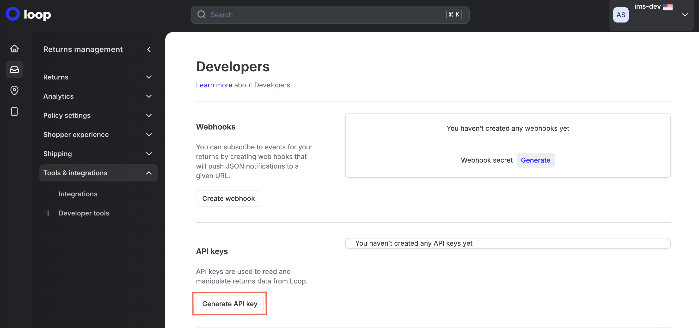
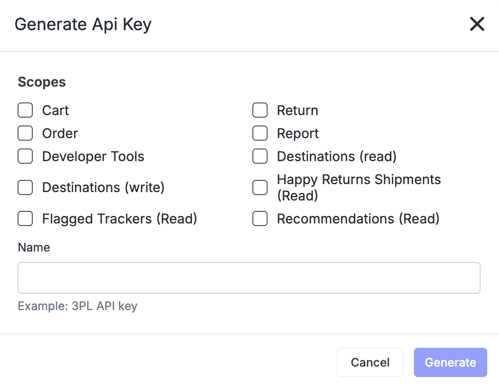
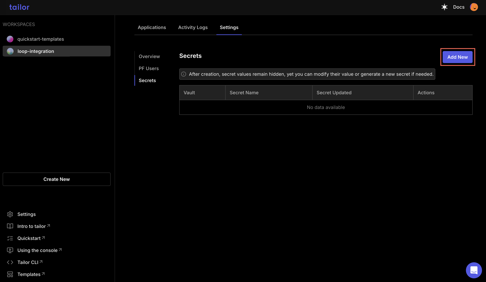
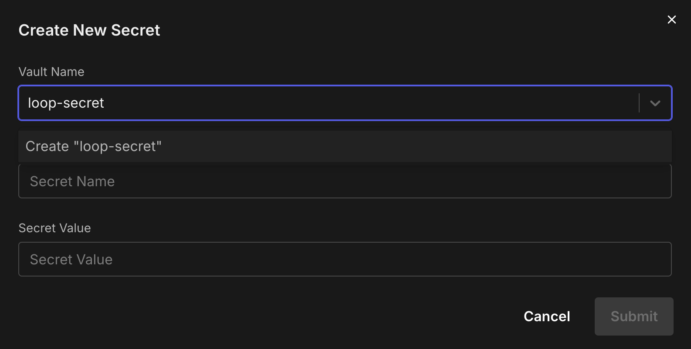

# Integrate Loop with Tailor Platform

## Overview

[Loop](https://docs.loopreturns.com/welcome) is a leading platform designed to simplify returns and exchanges, helping merchants streamline the post-purchase experience while reducing the operational burden of managing returns.

The integration of the Tailor Platform with Loop enables businesses to synchronize orders and product catalogs for efficient return processing.
It also allows automation of key tasks such as return approvals, shipping label generation, and restocking, significantly saving time for merchants.

## Tailor Platform Triggers

You can integrate Loop with Tailor Platform using triggers. Refer to [executor service guide](/guides/executor/overview) to learn about different types of triggers.

## Connect Loop

This integration guide will walk you through the steps to set up a connection between Tailor PF and Loop.

### 1. Get the API key

Before you can begin integrating the Tailor Platform with Loop, you'll need to get an API key.

To get your API key, follow the below steps:

1. Create an account with Loop

This is a prerequisite to access the Loop admin portal.

2. Connect your store (e.g., your Shopify store)

Integrating your store is essential for managing returns through Loop.

3. Set Up Return Portal URL

This URL is essential for directing customers to the correct page for processing returns.

4. Navigate to `Returns management` and select `Tools & integrations`.

5. Within `Tools & integrations`, select `Developer tools`.

In the Developer tools section, you can generate and manage your API keys. To generate a new API key, click on `Generate API Key`.



6. Select the desired scopes

Select the scope and then click `Generate`.



### 2. Store Loop Credentials

Store your Loop API key as a secret in the Tailor PF using one of the following methods:

#### Using the Tailor CLI

1. Create a vault to store the API key

Run the following commands to create a vault named loop-vault and to store the secret key.

```bash
tailor-sdk secret vault create loop-vault
tailor-sdk secret create --vault-name loop-vault --name loop-key --value {$api_key}
```

#### Through the Console

1. Navigate to your workspace where the app is deployed and select `settings` tab to add the secret



2. Create a new vault and add the API key



### 3. Making API requests to loop API

You can call the [Loop APIs](https://docs.loopreturns.com/api-reference/latest/return-actions/process-return) using triggers.
