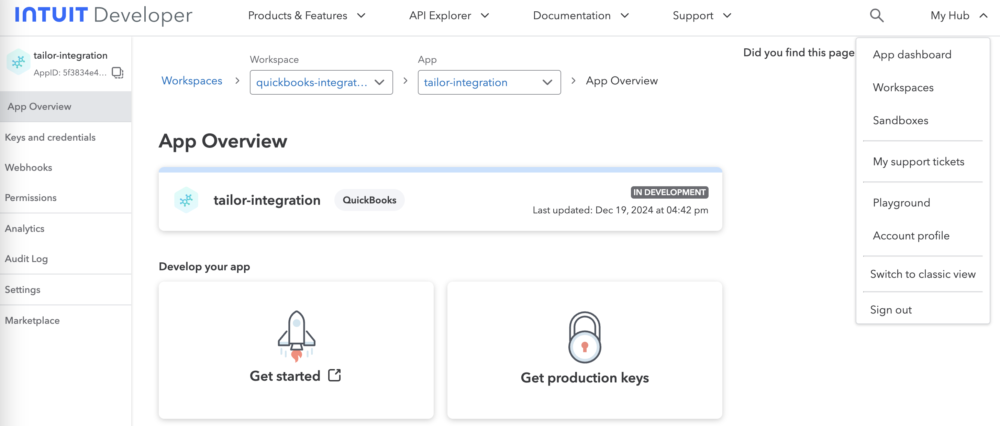
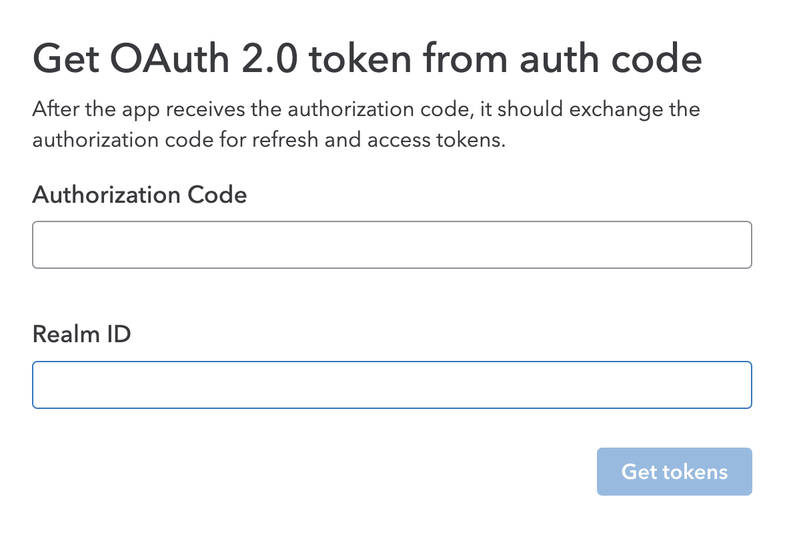
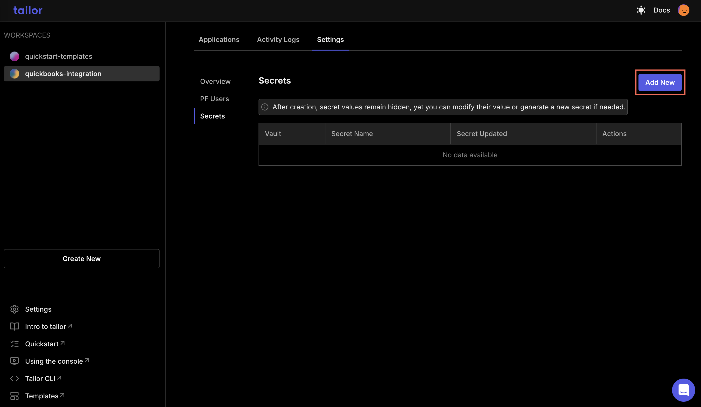
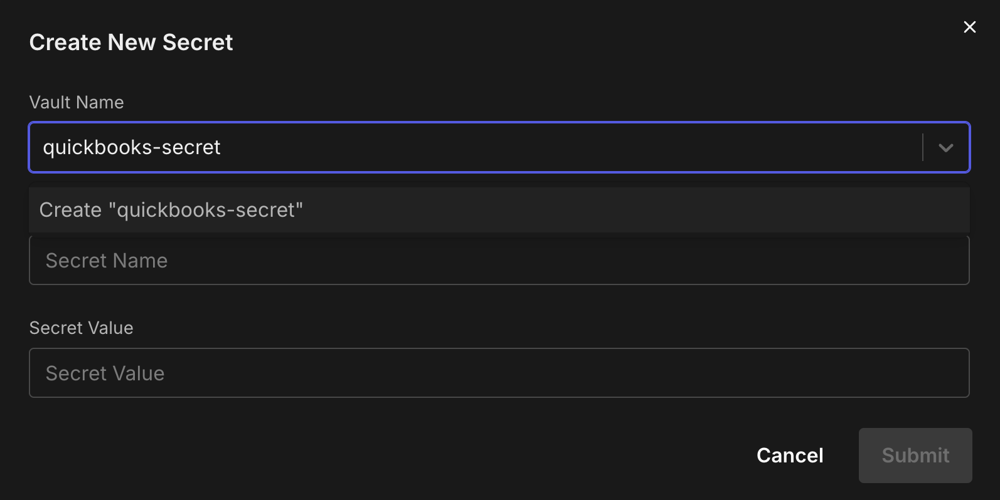

# Integrate QuickBooks with Tailor Platform

## Overview

QuickBooks is an accounting software that provides comprehensive financial management tools, including invoicing, expense tracking, payroll processing, and financial reporting.
Integrate the [QuickBooks API](https://developer.intuit.com/app/developer/qbo/docs/get-started) into your applications to automate workflows and streamline financial management processes.

In this guide, we will explain how to integrate QuickBooks with Tailor Platform by leveraging the platform's powerful triggers.

## Tailor Platform Triggers

You can integrate QuickBooks with Tailor Platform using triggers. Refer to [executor service guide](/guides/executor/overview) to learn about different types of triggers.

## Connect Quickbooks

This integration guide will walk you through the steps to set up a connection between Tailor PF and QuickBooks.

### Prerequisites

Before you begin integrating with the QuickBooks API, you'll need to:

1. Create an [Intuit Developer account](https://developer.intuit.com/app/developer/homepage)

1. Create a workspace

1. Create a new app

- Choose an app name
- Add required permissions (e.g., `com.intuit.quickbooks.accounting`)

### 1. Getting Your Access Token

QuickBooks uses OAuth 2.0 for API authentication. Follow these steps to get your access token:

1. Log in to your QuickBooks account

1. Select `My Hub` from the option menu and click `Playground` to access the authentication testing environment



The `Playground` is a testing environment that helps you understand the OAuth 2.0 flow and obtain your access token.

Follow these steps in the `Playground` to generate your authentication credentials.

1. Get Authorization Code

- Select your workspace

- Select your app

- The Client ID and Client Secret will be automatically loaded

- Configure OAuth settings:
  - Select the scope com.intuit.quickbooks.accounting

- Click the `Get authorization code` button

2. Get OAth 2.0 token from auth code

- In this section the authorization code and Realm ID will be pre-loaded automatically

- Click the `Get tokens` button



### 2. Store QuickBooks Credentials

Store your QuickBooks access token as a secret in the Tailor PF using one of the following methods:

#### Using the Tailor CLI

1. Create a vault to store the API key

Run the following commands to create a vault named quickbooks-vault and to store the secret key.

```bash
tailor-sdk secret vault create quickbooks-vault
tailor-sdk secret create --vault-name quickbooks-vault --name quickbooks-key --value {$access_token}
```

#### Through the Console

1. Navigate to your workspace where the app is deployed and select `settings` tab to add the secret



2. Create a new vault and add the access token



### 3. Making API Requests to QuickBooks

You can call the [QuickBooks APIs](https://developer.intuit.com/app/developer/qbo/docs/api/accounting/all-entities/account) using triggers.

#### Base URL

All API requests should be made to the following base URL:

- Production: `https://quickbooks.api.intuit.com/v3/company/<realmId>`

- Sandbox: `https://sandbox-quickbooks.api.intuit.com/v3/company/<realmId>`
