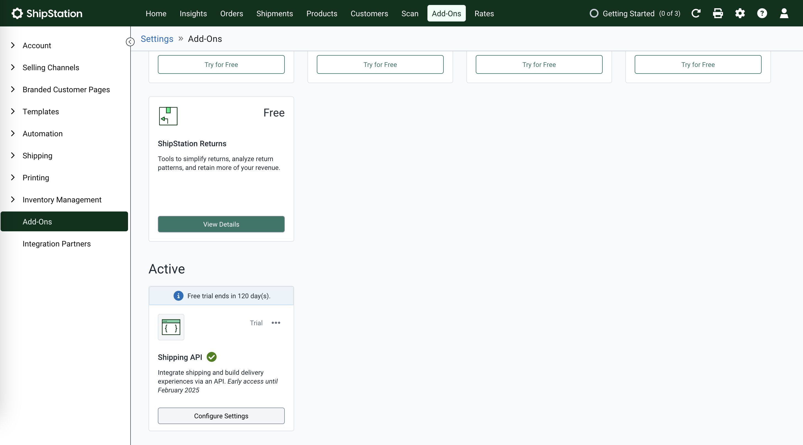
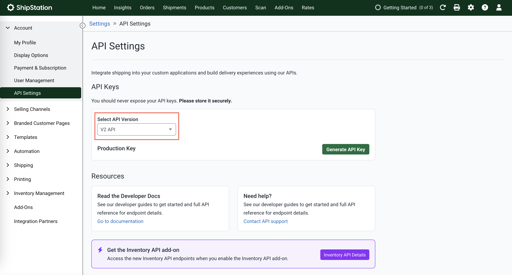
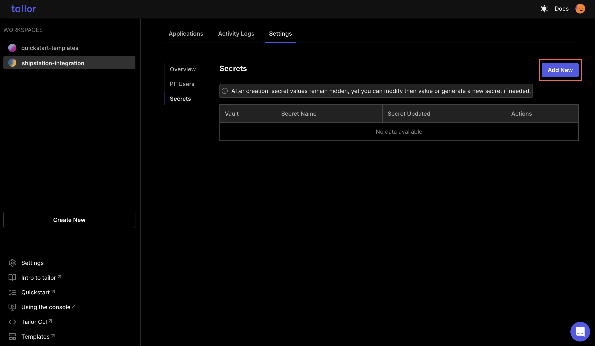
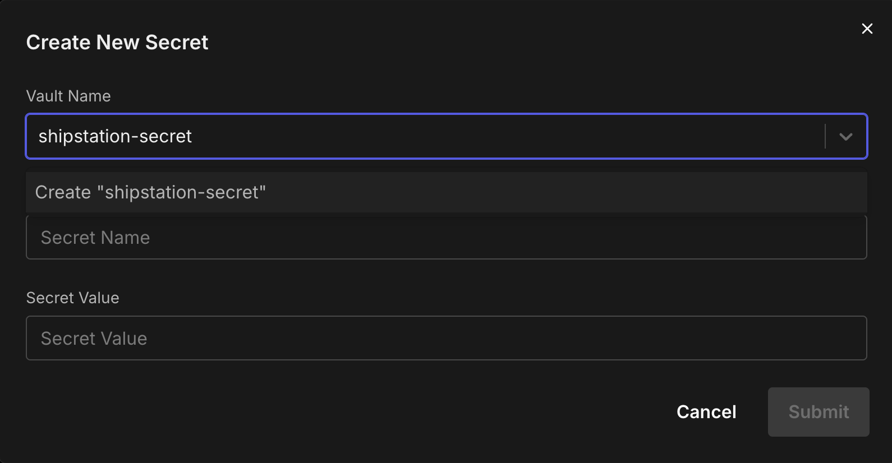

# Integrate ShipStation with Tailor Platform

## Overview

[ShipStation](https://www.shipstation.com/docs/api/) is a powerful shipping software solution designed to simplify and optimize order fulfillment for e-commerce businesses of all sizes.

The integration of Tailor Platform and ShipStation enables businesses to synchronize inventory, automate order processing, and streamline shipping workflows, ensuring real-time data exchange while reducing manual effort.

## Tailor Platform Triggers

You can integrate ShipStation with Tailor Platform using triggers. Refer to [executor service guide](/guides/executor/overview) to learn about different types of triggers.

## Connect ShipStation

This integration guide will walk you through the steps to set up a connection between Tailor PF and ShipStation.

### 1. Get the API key

Before you can begin integrating the Tailor Platform with ShipStation, you'll need to get an API key.

1. Log in to your ShipStation account.

1. From the top navigation bar, select `Add-Ons`.

1. Enable the `Shipping API` to generate the API keys.



4. Navigate to `Account` and select `API Settings`.

Choose the `API version` and click `Generate API Key`.



Production API Key: Actions performed using a production API key may result in charges. Therefore, it is not advisable to use these keys for development or testing purposes.

Sandbox API Key: These keys are intended for development and testing. Sandbox keys are easily identifiable as they always begin with TEST\_. However, please note that the ShipStation API v2 sandbox environment is not currently available.

### 2. Store ShipStation Credentials

Store your ShipStation API key as a secret in the Tailor PF using one of the following methods:

#### Using the Tailor CLI

1. Create a vault to store the API key

Run the following commands to create a vault named shipstation-vault and to store the secret key.

```bash
tailor-sdk secret vault create shipstation-vault
tailor-sdk secret create --vault-name shipstation-vault --name shipstation-key --value {$api_key}
```

#### Through the Console

1. Navigate to your workspace where the app is deployed and select `settings` tab to add the secret



2. Create a new vault and add the API key



### 3. Making API requests to ShipStation API

You can call the [ShipStation APIs](https://docs.shipstation.com/openapi) using triggers.
